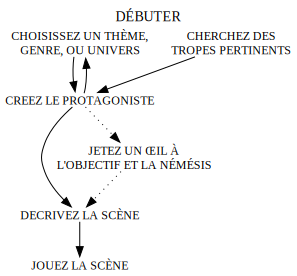
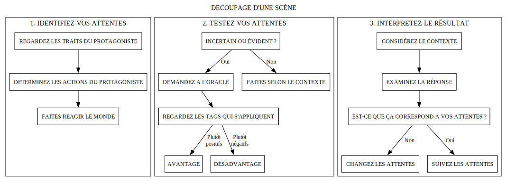
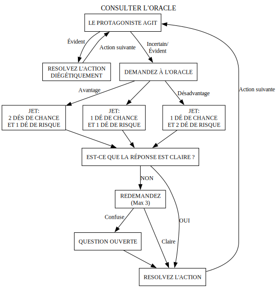

# Avant-propos

Bonjour sur cette traduction du Document de Référence du Système de Loner 3ème édition. Vous pouvez retrouver [la version originale ici](https://loner.zotiquestgames.com/#/en/loner-en).

# Qu'est-ce que *Loner* ?

*Loner* est un jeu de rôles solo minimaliste. Il est conçu pour vous faire jouer un seul personnage — votre Protagoniste — et lui faire vivre des histoires par la force de vos choix et les décisions aléatoire d'un Oracle.

A l'opposé des aventures solo suivant un chemin prédéfini, *Loner* vous permet de construire l'aventure au fil de l'eau. Au lieu de choisir une fin préconçue, vous allez poser des questions à l'Oracle, interpréter ses réponses énigmatiques, et pimenter le voyage de rebondissements et de changements de direction. *Loner* est un jeu fait d'imprévus, singulier et surprenant.

Chaque session de jeu de *Loner* est un mélange de structure et d'incertitude. Faites des choix, testez vos idées, et de temps en temps confrontez-vous aux changements de plan que le monde vous impose. Et quand ça arrive, il est l'heure pour vous de vous adaptez, et d'amenez votre histoire vers de nouveaux chemins.

*Loner* suit les principes suivants :

1. **Portable :** tout ce dont vous avez besoin c'est de quelques dés à six faces, de quoi écrire, et votre imagination.
2. **Léger :** centré autour d'une seule mécanique de jeu, *Loner est facile à apprendre et rapide à jouer.
3. **Basé sur les tags :** les personnages, les événements, les objets, tout est tags, car mieux vaut une description plutôt que des nombre.
4. **Émergent & ouvert :** aucune histoire n'est déjà écrite, chaque session possède sa propre narration.

*Loner* a été pensé pour être rapide, fluide, narratif, et sans complexité numérique. Vous pouvez jouer un aventurier solitaire dans un monde en ruine, un espion en mission, une IA rebelle explorant le cyberespace. *Loner* s'adapte à votre vision.

# Qu'est-ce qu'un jeu de rôles ?

Un jeu de rôles (JDR) est une expérience narrative dans laquelle vous prenez le contrôle d'un personnage, prenant les décision qui façonneront son aventure dans un monde imaginaire. Le plus souvent le JDR est joué à plusieurs, avec un Maître de Jeu (MJ) endossant la responsabilité de créer l'univers dans lequel les personnages évoluent, contrôlant ce qui s'y passe et imaginant les épreuves à affronter. Cependant *Loner* est un JDR solo, et vous êtes ainsi à la fois en charge de la narration et de la direction de votre personnage.

# En quoi *Loner* est différent

Contrairement à d'autres JDR et livre-jeux avec des choix prédéfinis, ou à l'aspect plus ludique, *Loner* est un jeu avec une narration émergente. Vous écrivez l'histoire en même temps que vous jouez. Au lieu de suivre un script, vous posez des questions fermées (Oui/Non), qui rendent l'aventure incertaine et surprenante.

L'univers dans lequel votre Protagoniste évolue est lui aussi en constante évolution, réagissant à ses actions, ses motivations, et aux ciconstances au fil de la progression de l'histoire. Vous définissez la scène, l'Oracle change votre destin, et ensemble, vous dessinez une aventure unique à chaque fois que vous jouez.

# Jouer en toute sécurité

Quand vous jouez seul, vous avez le contrôle total sur votre expérience de jeu. *Loner* vous laisse explorer à votre guise, mais c'est aussi à vous de poser les limites. Certains thèmes peuvent s'avérer intense et émotionnellement impactant. Si c'est le cas, faites une pause, prenez le temps de la réflexion, et si besoin changez de sujet, surtout si un élément vous met mal à l'aise. Le JDR vous permet de laisser s'exprimer votre créativité et votre imagination, il n'est pas là pour provoquer votre détresse.

Comme vous êtes la seule personne au commande, vous n'avez pas besoin d'outils de sécurité émotionnelle utilisés par en groupe. À la place, suivez cette simple règle : **si une scène vous met mal à l'aise, changez-là**. Vous pouvez rembobiner, recadrer, ou tout changer, c'est votre partie.

Le but de *Loner* est de vous faire vivre une grande aventure, et non de vous forcer à traverser des moments douloureux.

# Ce dont vous avez besoin pour jouer

Pour jouer à *Loner*, vous avez besoin :

- **de 4 dés à 6 faces (d6) :** deux paires de couleurs différentes.
- **De quoi écrire :** un bout de papier et un crayon c'est parfait, des cartes vierges et des post-its sont un plus.
- **d'une fiche de personnage :** vous pouvez utilisez celle fournie dans le livre, ou une simple feuille.

Vous pourriez également avoir besoin :

- **d'un journal :** *Loner* n'est pas un jdr de type journaling, mais vous pourriez ressentir le besoin de coucher sur papier des notes sur les personnages, les lieux, les éléments d'histoire importants. Si vous jouez souvent à la même aventure ça vous aidera à garder une meilleure cohérence.

Et c'est tout ! Aucun livre de règles à mémoriser, pas de matériel en pagaille, juste une poignée de dés et votre imagination.

# Choisissez un genre ou un univers

Chaque aventure de *Loner* prend place dans un **monde imaginaire** différent. Vous devez le choisir avant de commencer à jouer. Quelques pistes :

- L'univers de votre **série, votre livre ou votre JDR préférés**.
- Un genre qui vous aimez ou que vous êtes curieux d'explorer.
- Un monde **généré aléatoirement**.

Si vous avez besoin d'inspiration :

- **Piochez dans des listes de sujets**
- **Utilisez le pack d'aventure** (présent dans le livre)
- **Laissez votre Protagoniste découvrir le monde**, créez-le d'abord, puis construisez ce qui l'entoure

Il n'y a pas de bonne ou de mauvaise façon de le faire. L'histoire prendra forme en même temps que vous allez jouer, peu importe si vous commencez par le monde ou par votre Protagoniste.

# Créez votre Protagoniste

Votre personnage — le **Protagoniste** — est l'élément le plus important de votre histoire. Il ne possède aucune statistiques, mais est défini par des traits descriptifs qui définissent la manière dont il intéragit avec le monde.

## Création pas à pas

1. **Choisissez un <u>Nom</u> :** un qui correspond au ton et à l'univers de votre histoire.
2. **Définissez un <u>Concept</u> :** un résumé de ce qu'est votre personnage en une courte phrase.
3. **Sélectionnez deux <u>Compétences</u> :** des capacités uniques ou une expertise.
4. **Ajoutez une <u>Fragilité</u> :** une faiblesse ou un défaut.
5. **Ajoutez deux <u>Pièces d'équipement</u> :** des objets utiles et spécialisés, qui font sens dans le monde.
6. **Mettez en place un <u>Objectif</u> et une <u>Motivation</u> :** qu'est-ce qui anime votre Protagoniste, et pourquoi.
7. **Identifiez une <u>Némésis</u> (optionnel) :** un rival, un ennemi, une opposition.
8. **Démarrez avec 6 points de <u>Chance</u> :** c'est votre abilité à éviter l'échec, et vous les récupérez après un conflit.

## Qu'est-ce qui fait un bon **Concept** ?

Un **Concept** c'est comme une étiquette collée à votre Protagoniste, qui vous dit tout ce qu'il faut savoir en une seule phrase. Les meilleurs **Concepts** sont évocatifs et concis, permettant de saisir immédiatement le rôle, la personnalité, ou le passé du Protagoniste.

✅ **Bons 📌 Exemples :**
- *Une chasseuse de prime rusée* – suggère l'expertise dans la traque et la tromperie.
- *Érudit maudit* – informe sur la connaissance, mais aussi un fardeau.
- *Occultiste exilé* – indique un grand pouvoir lié à un passé trouble.

❌ **Mauvais 📌 Exemples :**
- *Combattant très fort* – trop générique, qu'est-ce qui le rend unique ?
- *Personne héroïque* – pas suffisamment spécifique, qu'est-ce qu'elle fait exactement ?
- *Homme à tout faire* – vague, ne fournit aucun élément caractéristique.

Pensez au **Concept** comme si c'était une phrase d'accroche, un moyen de "voir" le personnage d'un coup d'œil.

## Qu'est-ce qui fait une bonne **Compétence** ?

Les **Compétences** dans *Loner* sont d'ordre qualitatif plutôt que numérique. Pas de bonus ou de stats, mais une description qui vous donne **une permission narrative** – une **Compétence** vous dit ce dont est capable le Protagoniste.

✅ **Bons 📌 Exemples :**
- *Mécanicien hors-pair* – suggère une compréhension intuitive et approfondie de la mécanique.
- *Marcheuse d'ombre* – implique une grande discrétion et des mouvements dans les ténèbres.
- *Génie tactique* – indique un fort esprit stratégique et une bonne plannification.

❌ **Mauvais 📌 Exemples :**
- *Fort* – trop large; quelle genre de force ?
- *Intelligent* – vague; dans quel domaine ?
- *Combat* – n'indique aucune spécialité ou style spécifique.

Au moment de choisir une Compétence, demandez-vous ceci : **comment change-t-elle la manière dont le Protagoniste intéragit avec le monde ?**. Si c'est trop vague, précisez ou reformulez, soyez plus précis.

## Pourquoi l'**Objectif**, la **Motivation** et la **Némésis** devrait émerger en jouant

ces trois éléments sont étroitement liés à l'histoire et il est donc conseillé de les choisir en se basant sur le **contexte de jeu** plutôt que de les piocher dans une liste d'éléments aléatoires.

- **L'Objectif** définit ce vers quoi le Protagoniste se dirige activement.
- **La Motivation** explique pourquoi il poursuit l'Objectif.
- **La Némésis** est ce qui se dresse sur votre chemin, il peut s'agir d'une personne, mais aussi d'une organisation ou même d'une force plus abstraite.

Puisque *Loner* est un jeu au gameplay émergent, ces éléments devraient être choisi **en se basant sur l'univers, le ton, et les premiers moments de jeu**, plutôt que générés aléatoirement.

✅ **Si décidé au fil de l'histoire :**
- L'histoire se déroule naturellement, et l'Objectif est définit par les événements en jeu.
- La motivation est plus impactante car elle émerge des décisions prises.
- La Némésis se développe en un antagoniste fort avec des enjeux personnels.

❌ **Si choisi aléatoirement :**
- Le Protagoniste pourrait avoir un Objectif qui semble déconnecté de l'univers.
- La Motivation peut paraître confuse ou peu intégré à l'histoire.
- La Némésis donne le sentiment de ne pas correspondre à l'univers, affaiblissant la tension de l'histoire.

| **Approche** | **Résultat** |
|--------------|--------------|
| ✅ **au fil de l'histoire** | L'Objectif, la Motivation et la Némésis évoluent naturellement via les événements en jeu, créant une plus grande immersion et donnant plus de sens à l'histoire. |
| ❌ **Aléatoirement** | Ces éléments paraissent déconnectés de l'histoire, affaiblissant la portée du Protagoniste et les enjeux narratifs. |

## 📌 Exemple

> **Zahra Nakajima**  
> **Concept :** Chat de gouttière pleine d'esprit  
> **Compétences :** Connaissance de la rue, Preste  
> **Fragilité :** Miséricordieuse  
> **Équipement :** Couteau, Cartouche d'O2  
> **Objectif :** Mettre la main sur une technologie inconnue pour sauver sa planète  
> **Motivation :** Elle se sent responsable de la survie de son monde  
> **Némésis :** L'Ordre des Naturaliste, un groupe d'extrêmistes qui veulent éradiquer toute évolution technologique  
> **Chance :** 6

Ici, l'Objectif et la Némésis de Zahra ne sont pas arbitraire, ils viennent du monde dans lequel l'histoire prend place. Sa Motivation est liée à sa personnalité, créant un **enjeu émotionnel** donnant du sens à son aventure.

Si vous n'êtes pas sûr de l'Objectif, la Motivation, ou de la Némésis, commencez à jouer ! Laissez les premières scènes mettre à jour ces éléments au lieu de les décider dès le début.

# Tout est personnage !

Dans *Loner* tout ce qui joue un rôle important dans l'histoire — que ce soit une personne, un vaisseau, ou une ancienne malédiction — est traité comme un **personnage**. Ça signifie que la même approche descriptive utilisé pour le **Protagoniste** s'applique à tout ce qui revêt de l'importance.

## Personnages vivants (PNJ, Ennemis, Organisations)

Toute personne, créature, ou faction, qui possède un **rôle distinct** dans l'histoire suit une procédure similaire à celle du Protagoniste :

- Elle possède **un Concept** qui définit son identité.
- Elle peut posséder **des Compétences et des Fragilités**, comme le Protagoniste.
- Elle peut posséder **des Objectifs, des Motivations ou des Némésis**.
- Elle intéragit avec le monde via des **Tags**, influençant par ce biais la manière dont une scène se déroule.

## 📌 Exemple

> **Caine Trask**  
> **Concept :** Homme de loi impitoyable  
> **Compétences :** Traque, Fou de la gâchette  
> **Fragilité :** Suit un code d'Honneur  
> **Équipement :** Revolver à plasma, Drone de surveillance haut de gamme  
> **Objectif :** Capturer les fugitifs et les criminels à tout prix  
> **Motivation :** Croit que la justice est absolue, aucune négotiation possible  
> **Némésis :** Le Syndicat de l'Ombre, un réseau criminel qui n'arrête pas de lui glisser entre les doigts  
> **Chance :** 6

## Personnages non vivants (Objets, Véhicules, Malédictions)

Parfois ce qui n'est pas vivant **influence quand même activement l'histoire**, et est donc traité comme un personnage. Contrairement aux personnages vivants :

- Ça possède **un Concept**, **des Compétences** et des **Fragilités**.
- **Ça n'a pas d'Objectif, de Motivation ou de Némésis**.
- C'est défini par **sa fonction et son impact** sur l'histoire.
- Ça utilise quand même les **Tags** pour représenter leur usage, ou le défi que ça représente.

## 📌 Exemple

> **L'archeciel du siècle**
> - **Concept :** un vaisseau spacial en mauvais état
> - **Compétence :** Système de sauts hyperspacial, Circuits de camouflage
> - **Fragilité :** Messager d'un autre âge
> - **Chance :** 6

# Tags descriptifs

Les Tags sont **de courtes phrases** qui décrivent et façonnent l'univers dans lequel le Protagoniste évolue. Ce ne sont pas des nombres ou des stats, mais **des mots qui comptent** en jeu.

Tout dans *Loner* — personnages, lieux, objets, événements — peut avoir des Tags. Ces Tags servent à déterminer le contexte d'une scène, et comment la situation est **avantageuse ou désavantageuse**.

## Types de Tags

Les Tags peuvent être regroupé en trois catégories :

- **Traits de personnage :** décrit **les compétences, les défauts, les objectifs et les motivations** d'un personnage, définissant ce à quoi ils excellent et ce qui les bloque.
*📌 Exemples : sniper vétéran, hanté par son passé, en quête de vengeance*

- **Détails :** c'est **l'environnement, les objets ou les éléments situationnels**, tous ces petits détails qui peut influencer l'histoire.
*📌 Exemples : couloir mal éclairé, coffre-fort de haute sécurité, pont en ruine*

- **Conditions :** réprésente **les effets, temporaires ou permanents** qui changent la manière dont un personnage agit ou ce qu'il doit surmonter.
*📌 Exemples : entorse à la cheville, crainte par les locaux, recherché par la police*

## Les Tags en jeu

Les Tags donne **du contexte**, pas des maths. Ils ne fonctionnent pas comme des stats ou des bonus, mais servent à déterminer si le Protagoniste **a l'avantage** ou s'il **est en mauvaise posture** dans une situation donnée. Si un Tag fait sens, il peut donner **un Avantage ou un Désavantage** à un jet.

✅ **Usage pertinent des Tags :**
- Le tag *Coffre-fort de haute sécurité* montre clairement que ça va être compliqué de le crocheter, vous lancez les dés **avec un Désavantage**.
- Le Protagoniste a la Compétence **Sniper vétéran**, lors d'un duel il aura donc **un Avantage**.

❌ **Ce que les Tags NE FONT PAS :**
- Valeur numérique (*+2 en Force* n'est pas un Tag).
- Un trait qui n'aurait aucun impact en jeu (*Personne gentille* n'est pas un Tag impactant sauf si son usage est fréquent pour justifier un élément important de l'histoire).

Voyez les Tags comme des **panneaux de signalisation narratifs**, permettant de guider l'aventure par leur impact.

# Avant votre aventure

À peine votre Protagoniste défini vous pouvez commencer à jouer, mais il peut être intéressant avant de prendre un peu de temps pour **mettre en place le décor**, dans le but de rendre votre aventure plus immersive et cohérente.

## Une toile de connexions

- **Votre Némésis est un PNJ :** si vous avez défini la Némésis du Protagoniste, vous avez déjà créé un Personnage Non Joueur (ou PNJ) clé. Vous devriez lui faire une fiche de personnage, puisque vous allez très probablement la rencontrer de nouveau.
- **Alliés et Contacts :** est-ce que le Protagoniste a des amis, des mentors, des rivaux ? Listez-les tous avec une courte description pour chacun, il vous sera ensuite beaucoup plus facile de vous les remémorer lorsqu'ils pourront apparaître lors de l'histoire.

Préparer en avance ce genre d'éléments vous aidera à avoir un univers qui vous semblera plus vivant et plus réaliste, dans lequel vous vous plongerez plus aisément.

## Suivre le monde

Au-delà des personnages, vous devriez prendre note :
- **des lieux importants :** les endroits que vous avez visité et sur lesquels le Protagoniste va probablement revenir, comme la cachette des criminels, un temple secret, ou une ville ravagée par la guerre.
- **des événements majeurs :** tout ce qui est suffisamment significatif pour avoir un impact fort sur l'histoire du Protagoniste, comme une rébellion locale ou un désastre imminent.

Pas besoin d'y mettre trop de détails, juste quelques mots pour vous permettre de l'utiliser par la suite pour faire prendre des directions imprévues au récit.

Un peu de préparation aménera à un univers plus riche, ayant une vie propre en parallèle de votre aventure.

# Débuter la partie

Toutes les grandes aventures démarrent **quelque part**. Dans *Loner*, vous définissez la **scène de début** en décidant où le Protagoniste est **maintenant**, et quels sont les difficultés auxquelles il doit faire face.

Il y a **deux grandes manières** de faire :

## **1. Au cœur de l'action (scène dramatique)**

Démarrez **au milieu de l'action**, votre Protagoniste est déjà sur le point de **s'échapper, se battre, négotier, ou découvrir un secret**.

✅ **Construisez du momentum immédiatement :** l'histoire à **déjà commencée**.  
✅ **C'est plus facile d'improviser :** la scène va d'elle-même orienter les prochaines actions les plus logiques.

📌 **Exemple :**
> Votre Protagoniste **court dans une allée éclairée par des néons**, des balles sifflantes dans son dos. Un chasseur de prime concurrent se rapproche, **est-ce qu'il trouvera de quoi se mettre à couvert à temps ?**

Cette technique est empruntée à la littérature et au cinéma, où **débuter in media res** permet d'accrocher l'audience dès les premières secondes. Pensez à Indiana Jones et l'Arche d'Alliance, dès le début le héros **est déjà dans le temple** à éviter les pièges. **C'est bien plus engageant que s'il avait été à lire un livre chez lui !**

💡 **Astuce :** une scène d'ouverture dramatique n'a pas besoin d'être une scène de combat, seulement de tension, d'un sentiment d'urgence, ou d'un **conflit clair qui doit être résolu**.

## **2. Poser le cadre de l'aventure d'abord**

Si vous préférez un peu plus de structure, vous pouvez utilisez la méthodes des 5 questions (Qui, Quoi, Pourquoi, Où, Comment, plus Obstacle). Cette manière de faire va vous donner **un cadre de mission** avant de vous lancer dans l'histoire.

Posez les questions suivantes :
- **Qui ?** *(Qui a déclenché l'aventure ?)*
- **Quoi ?** *(Quelle mission ou tâche est en cours/attendu ?)*
- **Pourquoi ?** *(Pourquoi le Protagoniste le fait ?)*
- **Où ?** *(Où l'aventure se déroule-t-elle ?)*
- **Comment ?** *(Comment l'histoire commence ? Quels en sont les événements d'origine ?)*
- **Obstacle ?** *(Qu'est-ce qui se dresse sur le chemin immédiatement ?)*

| D6 | **Qui ?** Initiateur | **Quoi ?** Mission | **Pourquoi ?** Incitation | **Où ?** Cible | **Comment ?** Origine | **Obstacle ?** Complication |
|:-:|:-:|:-:|:-:|:-:|:-:|:-:|
| 1 | Autorité | Secourir | Aide | Personne | Rencontre informelle | Opposition |
| 2 | Organisation | Protection | Fortune | Groupe | Vieille connaissance | Tromperie |
| 3 | Allié | Exploiter | Cœrcition | Trésor | Rumeurs | Environnement |
| 4 | Mentor | Explorer | Impulsion | Lieu | Capture | Déguisement |
| 5 | Personne en détresse | Fuite | Ambition | McGuffin | Incident | Temps |
| 6 | Maitre-chanteur | Poursuite | Revanche | Confession | Objet | Espace |

✅ **Poser les bases :** le Protagoniste a un **Objectif** dès le début.  
✅ **Donner une structure :** vous connaissez **les enjeux** avant même le début de la première scène.

> **Qui ?** Mentor  
> **Quoi ?** Exploiter  
> **Why ?** Aide  
> **Où ?** McGuffin  
> **Comment ?** Rumeurs  
> **Obstacle ?** Temps  
>  
> Tobias Wethern a pris Zahra sous son aile à la mort de ses parents. C'est pourquoi elle ne peut rien lui refuser. Tobias veut que Zahra **vole un datapad** d'une filiale de la Corporation Leton. Il ne sait pas exactement ce qu'il contient, mais **dans 24 heures, il sera déplacé ailleurs**. Plus de temps à perdre.

## **Laquelle choisir ?**

📌 **Scène dramatique :** à choisir si vous voulez **sauter directement dans l'action** et découvrir l'histoire en jouant.  
📌 **Poser le cadre :** à choisir si vous préférez **un objectif de mission structuré et structurant** avant le début de l'aventure.

Vous **n'avez pas à choisir l'un ou l'autre**, vous pouvez aussi **combiner les deux** :
1. **Posez le cadre de la mission ...**
2. **... et débutez par une scène dramatique !**

📌 **Exemple :** vous **déterminez** la mission (*voler le disque dur d'un hacker rival*), mais au lieu de démarrer par une préparation de l'action, vous **sautez dedans** (*le Protagoniste est déjà à l'intérieur de l'appartement du hacker, et les alarmes résonnent !*).

Les deux méthodes servent **différents style de jeu**, mais ensemble elles offrent **un ouverture éclatante dans l'aventure**.

# Laisser l'histoire avancer

Une fois que vous avez mis en place **la première scène**, commencez à jouer ! L'Oracle va vous guider dans ce qui va se passer ensuite, apportant de la surprise et des Twists sur le chemin.

{: .diagram}

## Garder l'action en mouvement

Une partie de *Loner* est constitué d'une série de scènes, chacune représentant un moment différent dans le temps, un moment durant lequel quelque chose d'important a lieu.

Chaque scène a un objectif à court terme, qui doit correspondre à une action précise, un défi qui doit être résolu dans la scène si possible pour permettre à l'histoire d'aller de l'avant ensuite.

## Une scène en 3 étapes

Toute scène suit un rythme naturel :

1. **Mise en place des enjeux :** quel est l'objectif du Protagoniste ? Regardez **ses traits, son Objectif, sa Motivation** et déterminez ses prochaines actions. Comment pensez-vous que le monde va réagir ?
2. **Tester l'évidence :** si la suite des événements semble flou (où si la confiance excessive tente le Destin), consultez l'Oracle avec une **question fermée (oui/non)**. Utilisez les **Tags** pour déterminer si le Protagoniste est [avantagé ou non](#avantage-et-désavantage).
3. **Interprétation du résultat :** la réponse de l'Oracle peut confirmer les attentes, ou les modifier. Comment le résultat redessine la scène ? Quelles nouvelles possibilités ont émergé ?

Au début vous pourriez trouvez cette structure contraignante, mais avec le temps elle va devenir une seconde nature, permettant à l'histoire d'avancer naturellement.

{: .diagram}

# Identifier vos attentes

Les **traits, Objectif et Motivation** du Protagoniste définissent comment il intéragit avec le monde. Dans chaque scène, et basé sur ses éléments, des attentes **qui font sens** vont émerger.

Les attentes aident à guider l'histoire, mais elles ne nécessitent pas forcément de jet de dés. Si le résultat d'une action **est évident et logique**, alors c'est ce qui se passe. Cependant, en cas **d'hésitation, de risque, ou s'il y a une chance d'être surpris**, c'est qu'il est venu le temps de vérifier ces attentes en consultant l'Oracle.

## Quand consulter l'Oracle

- **Si le résultat est évident →** pas besoin de faire un jet, la scène se déroule comme attendu.
- **Si le résultat est incertain ou risqué →** consultez l'Oracle avec une question fermée (oui/non).
- **Si vous voulez un Twist inattendu →** demandez même si vous êtes confiant, parfois le monde agit d'une manière inattendu !

## 📌 Exemple 1 : aucun jet requis

> Zahra s'infiltre dans la filiale de Leton Corporation. Grâce à ses repérages préalable elle sait que la sécurité est **plus légère la nuit**. Puisque c'est logique avec les attentes, la scène se déroule sans problème : Zahra **s'introduit sans être détectée** sans avoir besoin de consultez l'Oracle.

## 📌 Exemple 2 : consulter l'Oracle pour l'incertitude

> Zarha rampe dans les conduits de ventilation, s'attendant à ce qu'ils soient dépourvu de surveillance. Mais est-ce qu'il n'y aurait pas **une alarme de sécurité** cachée à l'intérieur ? C'est incertain, elle demande donc à l'Oracle :  
>  
> **Est-ce qu'il y a une alarme dans les conduits ?**

## 📌 Exemple 3 : consulter l'Oracle pour un Twist inattendu

> Zahra arrive à se faufiler jusqu'à la salle serveur. Elle **sait**, grâce à les plans volés, que la porte **requiert juste une seule surcharge**, mais si elle se trompait ? Elle consulte l'Oracle :
>
> **"Est-ce que le système de sécurité est comme attendu ?"**
>
> La réponse est **Non, mais ...** la serrure a été **mise à jour récemment**, avec une **reconnaissance biométrique**, et la vraie surprise ? Les agents de sécurité viennent de débuter leur patrouille de minuit.

# Consulter l'Oracle

Dès que vous faites face à **une incertitude** dans votre aventure, vous allez consulter **l'Oracle** en posant **une question fermée (oui/non)** et en jetant les dés pour déterminer le résultat.

## Ce dont vous avez besoin

Vous avez besoin :  
✅ **de 2d6 d'une couleur** (*les Dés de Chance*)  
✅ **de 2d6 d'une couleur différente** (*les Dés de Risque*)  

## Comment faire un jet

Quand vous consultez **l'Oracle**, faites un jet de dés avec **1 Dé de Chance et 1 Dé de Risque**, et suivez ensuite les étapes suivantes :

## **Étape 1 : comparez les dés**

🔹 **Le Dé de Chance est le plus haut ?** → **Oui** (*Succès*)  
🔹 **Le Dé de Risque est le plus haut ?** → **Non** (*Échec*)  
🔹 **Les deux dés sont égaux ?** → **Oui, mais ...** (*Succès mais avec une complication, +1 au Compteur de Twists*)

## **Étape 2 : vérifiez les modificateurs**

📉 **Les deux dés sont inférieurs ou égal à 3 ?**

➝ Ajoutez **mais ...** (*Quelque chose se passe mal ou ajoute de la tension*)

📈 **Les deux dés sont supérieurs ou égal à 4 ?**

➝ Ajouter un **et ...** (*Quelque chose de positif arrive en plus*)

## **Découpage de la résolution**

🟢 **Dé de Chance > Dé de Risque → "Oui"**  
✅ **Les deux dés <= 3 → "Oui, mais ..."** *(Succès avec complication)*  
✅ **Les deux dés >= 4 → "Oui, et ..."** *(Succès avec un petit plus)*  

🔴 **Dé de Risque > Dé de Chance → "Non"**  
❌ **Les deux dés <= 3 → "Non, mais ..."** *(Échec, mais quelque chose de positif arrive)*  
❌ **Les deux dés >= 4 → "Non, et ..."** *(Échec avec des conséquence en plus)*  

⚖️ **Les deux dés sont égaux → "Oui, mais ..."** *(+1 au Compteur de Twists !)*

## 📌 Exemple : Infiltration

> Zahra souhaite **forcer une trappe de sécurité** sans déclencher l'alarme.  
> Elle demande à l'Oracle : **"Est-ce que Zahra arrive à forcer la trappe ?"**  
>
> 🎲 Jet : **Dé de Chance (5), Dé de Risque (4)**  
> ✅ **le Dé de Chance est le plus haut** → La réponse est **Oui** (*elle y arrive*).  
> ✅ **Les deux dés sont >= 4** → On ajoute **Et ...** (*un truc en plus vient l'aider*).  
>
> **Résultat :**  
> Zahra force la trappe **sans déclencher l'alarme**, et **elle trouve également un plan du bâtiment**.

Si le Dé de Risque avait donné **3** au lieu de **4**, la réponse aurait été juste **Oui**, sans d'autres avantages.

## Avantage et Désavantage

De temps en temps la situation ou un **Tag** va donner un **Avantage** ou un **Désavantage** lorsque vous consulterez l'Oracle, ceci afin de refléter la manière dont les circonstances affectent **positivement ou négativement* les efforts du Protagoniste.

## **Comment ça marche**

- **Avantage** → Ajouter un **Dé de Chance supplémentaire** 🎲 (circonstances positives, Compétence utile, conditions favorables).
- **Désavantage** → Ajouter un **Dé de Risque supplémentaire** 🎲 (handicaps, complications, conditions difficiles).
- Dans les deux cas, **lancez tous les dés et gardez le plus haut résultat uniquement**.

📌 **Exemple d'Avantage :**
> Zahra tente de **charmer un marchand suspicieux** pour qu'il lui révèle son arrière boutique de produits illégaux. Elle a le **Tag "Maîtresse de l'esbrouffe"**, elle fait donc un **jet avec Avantage** (2 Dé de Chance, 1 Dé de Risque).

📌 **Exemple de Désavantage :**
> Zahra essaie de **hacker la databank d'une grosse corporation**, en plein milieu d'un territoire ennemi, sans expertise en informatique, et alors que la sécurité est renforcée. Elle fait un **jet avec Désavantage** (1 Dé de Chance, 2 Dé de Risque).

## **Important !**

️⚠️️️️ **Les Tags ne sont pas des nombres !** Utilisez **intuitivement**, et non comme des bonus ou malus. L'objectif est de **garder le jeu fluide**, et pas de suranalyser chaque situation.

Au lieu de traité les Tags comme des modificateurs numériques, **pensez narratif** :
- *Est-ce que la situation profite ou défavorise le personnage ?*
- *Est-ce que le personnage peut faire appel à une compétence, un trait, ou une circonstance avantageuse ?*
- *Est-ce qu'un obstacle, un défaut, ou un facteur environnemental impose un désavantage ?*

## **Règles pour plusieurs Tags**

⚠️ **Il n'est pas possible de lancer plus de <u>deux</u> Dés de Chance ou <u>deux</u> Dés de Risque par jet.**

✅ **Si plusieurs Tags positifs ou négatifs peuvent s'appliquer, ils ne s'accumulent pas.**  
✅ **Si les deux types de Tags, positifs et négatifs, sont présents, ils s'annulent mutuellement.**  

| **Tag** | **Jet** |
| **Un ou plusieurs Tags positifs (sans Tags négatifs)** | **Avantage** (jet avec 2 Dés de Chance, 1 Dé de Risque) |
| **Un ou plusieurs Tags négatifs (sans Tags positifs)** | **Désavantage** (jet avec 1 Dé de Chance, 2 Dés de Risque) |
| **Tags positifs et négatifs qui s'annulent** | **Neutre** (jet avec 1 Dé de Chance et 1 Dé de Risque) |

## **📌 Exemple : hacker le datapad**

> Zahra essaie de **hacker une banque de données sécurisée** pour **retrouver des informations classifiées**. Cependant, **elle n'est pas une hackeuse compétente**, et **le système de sécurité est très avancé**.

### **Evaluer l'Avantage et le Désavantage**

🔹 **Tags positifs :** aucun (*elle n'a aucune compétence en hacking, ni aucun outil*)  
🔹 **Tags négatifs :**  
- *elle n'est pas une hackeuse compétente*
- *Système de sécurité très avancé*

- **Total : 2 Tags négatifs → elle fait un jet avec désavantage**
- **Le désavantage signifie un jet avec 1 Dé de Chance et 2 Dés de Risque**

### **Le jet de dés**

🎲 **Dé de Chance (5)**  
🎲 **Dés de Risque (3), (4) → On garde le meilleur (4)**

📌 **Résultat :**
- ✅ **Dé de Chance (5) > Dé de Risque (4)** → **Oui** (*Succès !*)
- ✅ **Les deux dés sont égaux ou supérieurs à 4** → Ajoutez **Et ...** (*Quelque chose en plus vient aider Zahra !*).

🚀 **Résultat final :**
> Zahra réussit à hacker la banque de données **et ...** elle tombe également sur une **transmission chiffrée** révélant une prochaine **opération corporatiste illégale**.

### **Pourquoi ce système fonctionne**

✅ **Garder le jet simple :** pas besoin de suivre des modificateurs.  
✅ **Encourager la narration :** au lieu de se focaliser sur des nombres, les Tags décrivent une situation, et si elle est compliqué ou non.  
✅ **Empêcher l'accumulation excessive :** un seul Avantage ou Désavantage est largement suffisant pour avoir un impact important sur le résultat.

{: .diagram}

# Interpréter l'Oracle

L'Oracle donne **une réponse simple**, mais **votre interprétation** est ce qui la rend impactante. Ne traitez pas l'Oracle comme juste une mécanique de jeu, utilisez-la **comme incitation narrative** pour faire avancer l'histoire.

| **Réponse** | **Résultat** |
|---|---|
| **Oui, et ...** | Vous obtenez ce que vous voulez, **+ un petit extra** |
| **Oui ...** | Vous réussissez votre action |
| **Oui, mais ...** | Votre réussite **à un coût** |
| **Non, mais ...** | Vous échouez, **mais** vous avez une compensation |
| **Non ...** | Vous échouez |
| **Non, et ...** | Vous échouez **+ et quelque chose fait empirer la situation** |

## Rendre le résultat intéressant

✅ **Les réponse directes** (*Oui/Non*) sont pratique mais peuvent paraître un peu fade, utilisez-les quand l'aventure a besoin de momentum.  
✅ **Les modificateurs** (*et .../mais ...*) ajoutent une couche de complexité et poussent la scène **vers de nouvelles directions**.  
✅ **Liez la réponse à un élément de l'histoire**, les personnages, les lieux, les pistes non résolues.

En **interprétant activement les résultats de l'Oracle**, plutôt que juste les utiliser tel quel, vous faites en sorte que chaque jet **ajoute de la tension, de la profondeur, ou de l'intrigue dans le jeu**.

## Méthodes pour interpréter l'Oracle

Il n'y a pas juste une seule façon d'interpréter les réponses de l'Oracle. Suivant **le contexte de la scène**, vous pouvez **interpréter le résultat de diverses manières**.

### 1. L'Oracle en tant qu'Intensité

Au lieu de lire le résultat comme un **succès ou un échec binaire**, traitez-le comme **une mesure de à quel point les choses se passent bien, ou mal** :

| **Réponse** | **Intensité** |
|---|---|
| **Oui, et ...** | **Succès majeur** (avantage important, bonus inattendu) |
| **Oui ...** | **Succès modéré** (résultat standard, les choses se passent comme attendu) |
| **Oui, mais ...** | **Succès avec un coût** (victoire partielle, complication inattendue) |
| **Non, mais ...** | **Échec avec compensation** (objectif non atteint, mais quelque chose d'utile arrive) |
| **Non ...** | **Échec modéré** (ça se passe mal, comme prévu) |
| **Non, et ...** | **Échec majeur** (erreur catastrophique, revers inattendu) |

📌 **Exemple :** Zahra essaie de passer un point de contrôle sans se faire repérer.
- 🎲 **Oui, et ...** → *non seulement elle se passe inaperçu, mais elle trouve également une clé d'accès sur le sol.*
- 🎲 **Oui ...** → *elle passe le point de contrôle inaperçue.*
- 🎲 **Oui, mais ...** → *elle passe, mais les gardes commencent soudainement à patrouiller la zone.*
- 🎲 **Non, mais ...** → *elle se fait attraper, mais les gardes pensent qu'elle est perdue, plutôt qu'en train de s'infiltrer.*
- 🎲 **Non ...** → *elle est découverte, et l'alarme résonne.*
- 🎲 **Non, et ...** → *elle est capturée, et enfermée à double tour.*

### 2. L'Oracle en tant que générateur de Twist

Au lieu d'une lecture succès/échec, laissez l'Oracle **introduire de nouveaux éléments** qui ne faisaient pas partie des attentes initiales.

📌 **Exemple :** Zahra essaie de hacker le mainframe de la corporation.  
- 🎲 **Oui, mais ...** → *elle déverrouille l'accès, mais les fichiers sont chiffrés, nécessitant une nouvelle étape.*
- 🎲 **Non, mais ...** → *elle échoue le hack, mais elle découvre que le mainframe est vulnérable à une faille externe.*
- 🎲 **Non, et ...** → *non seulement elle n'y arrive pas, mais elle déclenche en plus une alarme silencieuse, alertant la sécurité.*

### 3. L'Oracle en tant que Contrôle du Momentum

Vous pouvez également vous servir de l'Oracle pour déterminer **si la tension d'une scène évolue, montant, chutant, ou au contraire reste stable** :

| **Réponse** | **Momentum de scène** |
|---|---|
| **Oui, et ...** | **Pousse la scène en avant avec un développement majeur** |
| **Oui ...** | **Fait avancer l'histoire dans une direction prévisible** |
| **Oui, mais ...** | **Ajoute une complication qui ralentit la progression** |
| **Non, mais ...** | **Change le focus vers un chemin alternatif** |
| **Non ...** | **Amène la scène à un blocage** |
| **Non, et ...** | **Fait monter les enjeux significativement** |

📌 **Exemple :** Zahra interroge un indic.
- 🎲 **Oui, et ...** → *l'indic craque et raconte tout, et offre même son aide.*
- 🎲 **Oui ...** → *il donne à Zahra l'information qu'elle veut.*
- 🎲 **Oui, mais ...** → *il parle, mais certains détails semblent faux ou manquants.*
- 🎲 **Non, mais ...** → *il refuse de parler, mais sa réaction montre qu'il sait quelque chose de crucial.*
- 🎲 **Non ...** → *il refuse de parler.*
- 🎲 **Non, et ...** → *il se ferme et donne l'alerte de la présence de Zahra.*

Cette forme d'interprétation aide à **contrôler le rythme**, *Oui, et ...* fait avancer l'histoire rapidement, tandis que *Non, et ...* force un changement dramatique.

## 📌 Exemple : étendre l'histoire avec l'interprétation

📌 **Scénario :** Zahra essaie de s'introduire dans un centre de recherche.  
📌 **Question :** *"Est-ce qu'elle arrive à passer inaperçue ?"*  
📌 🎲 **Réponse de l'Oracle : Non, mais ...**

Au lieu d'un **échec simple**, voilà différentes interprétations possibles :

✅ **Intensité :** elle est vue, mais **seulement par un seul garde, et non l'intégralité de l'équipe**.  
✅ **Twist :** elle est attrapée, **mais la personne qui l'a trouvé est un ancien allié et non un ennemi**.  
✅ **Contrôle du Momentum :** elle est détecté, **mais au lieu de déclencher une alarme, les gardes partent à sa recherche, lui laissant une un peu de temps pour se cacher**.

💡 **En utilisant différentes interprétations, l'Oracle n'impose pas ce qui arrive, elle guide l'histoire vers de nouvelles directions.**

## L'Oracle en tant qu'outil narratif

✅ **Ne considérez pas la Réponse de l'Oracle de manière binaire :** essayez d'apporter de la nuance dans votre jeu.  
✅ **Utilisez toujours le contexte pour votre interprétation :** un *"Non, et ..."* lors d'une scène de combat se vivra différemment que nors d'une conversation diplomatique.  
✅ **Expérimentez avec différentes méthodes :** utilisez l'Oracle comme un **générateur d'intensité, de momentum, ou de Twists**, pour garder l'histoire vivante et dynamique.

## Réponse sibylline

Parfois la Réponse de l'Oracle **ne fera aucun sens** dans le contexte de la scène en cours. Au lieu de rester coincé, suivez les étapes suivantes pour faire avancer l'histoire.

## Comment gérer une Réponse sibylline

1. **Ne creusez pas trop :** évitez de reposer plein de questions pour forcer un résultat "logique". Trois questions fermées est déjà amplement suffisant, et si vous n'êtes toujours pas sûr, allez de l'avant.
2. **Recader la Réponse :** essayez de prendre du recul sur la situation. Est-ce que la Réponse pourrait **introduire une complication cachée**, ou **suggérer une vérité plus complexe** ?
3. **Utilisez une question ouverte :** si vous êtes quand même bloqué, faites un jet sur la **table d'inspiration** ou posez une question comme :
  - *"Qu'est-ce qui pourrait avoir un impact inconnu ?"*
  - *"Qu'est-ce que ça révèle que je n'ai pas considéré ?"*
4. **Par défaut, faites un "Oui, mais ..." :** si rien ne semble correspondre, traitez la Réponse comme si c'était un "Oui, mais .." et introduisez une **complication mineure** qui fait sens dans le contexte.

## 📌 Exemple : Gérer une Réponse Étrange

> **Question :** *"Est-ce que la taupe est toujours au bar ?"*  
> 🎲 **Réponse de l'Oracle : Non, et ...**
>  
> ❌ Ça n'a pas de sens — pourquoi elle s'en irait subitement ? Au lieu de rester coincer :
>  
> ✅ **Recadrer la Réponse :**  
> - *Peut-être que quelqu'un l'a prévenu du danger ?*  
> - *Peut-être a-t-elle été kidnappée ?*  
> - *Peut-être "Non, et ..." ne veut pas dire qu'elle est partie — peut-être qu'elle n'a jamais été là ?*  

> **Interpretation finale :**  
> La taupe n'est plus là, **et ... le barman vous évite nerveusement, suggérant une entourloupe.** Maintenant l'histoire avance **et l'intrigue s'épaissit**.

# Compteur de Twists

Le **Compteur de Twists** (ou retourment de situation) représente **l'augmentation de la tension dans la narration**. À chaque fois que vous obtenez un double sur un jet de dés (le Dé de Chance et le Dé de Risque font le même résultat), vous :

✅ **Ajoutez 1 au Compteur de Twists.**  
✅ Si le **Compteur atteint 3**, un **Twist se déclenche**, et le Compteur est remis à **0**.  

Si le Compteur est **inférieur à 3**, considérait le résultat comme un **"Oui, mais ..."** au lieu de déclencher un Twist.

## 📌 Exemple : La tension monte

> Zahra essaie de **décrypter les fichiers volés** pour obtenir des preuves contre la puissante corporation. Elle demande à l'Oracle :
>
> **"Est-ce que les fichiers contiennent des preuves d'activités illégales ?"**  
> 🎲 Jet : **(4) [4] → Double !**

✅ La réponse est **"Oui, mais ..."** → Les fichiers contiennent bien des activités illégales ...
✅ **+1 au Compteur de Twists** (Qui était déjà à **2**) → **Déclenchement d'un Twist !**

> **Twist déclenché :** le Compteur repasse à **0**, et vous lancez 2d6 sur la **Table des Twists** ...

🎲 Jet de Twist : **(1, 5) → "Un tiers" + "Changes l'objectif"**

> **Interprétation :** Zahra met la main sur une preuve — quand soudain, **un agent de la corporation la contacte pour lui faire une offre** :  
> *"Vous pouvez tout révéler ... Ou accepter un deal qui changera votre vie."*

# Déterminer un Twist

Quand le **Compteur de Twist atteint 3**, fait un jet avec **2d6** sur la table suivante :

| D6 | **Sujet**               | **Action**                  |
|:--:|:-----------------------:|:---------------------------:|
| 1  | Un tiers                | apparaît                    |
| 2  | Le Protagoniste         | change le lieu              |
| 3  | Une rencontre           | aide le Protagoniste        |
| 4  | Un événement physique   | agit contre le Protagoniste |
| 5  | Un événement émotionnel | modifie l'objectif          |
| 6  | Un objet                | termine la scène            |

Interprétez le **double résultat** dans le contexte de la scène actuelle. Un Twist devrait **provoquer un retournement dans l'histoire**, forçant le Protagoniste à s'adapter.

## **📌 Exemple : Comment un Twist peut changer l'histoire**  

> **Scénario :** Zahra est en cours d'infiltration dans un laboratoire high-tech pour voler des secrets industriels.  
> Elle demande : **"Est-ce qu'elle peut atteindre le serveur sécurisé sans se faire repérer ?"**  
> 🎲 Jet : **(3) [3] → Doubles !** → **Le Compteur de Twists atteint 3 → Un Twist est déclenché !**  
>  
> 🎲 Jet de Twist : **(4, 2) → "un événement physique" + "change le lieu"**  
>  
> **Interpretation :** Alors que Zahra s'approchait de la pièce du serveur, **une explosion fait trembler le bâtiment**. Les alarmes résonnent, la sécurité se réveille — **et la mission change !**. Au lieu de s'infiltrer, elle doit désormais **s'échapper de la structure qui s'effondre, avec toutes les données qu'elle peut récupérer**.  

## Pourquoi le Compteur de Twists est important

Le **Compteur de Twists** sert à alimenter *Loner* en **Surprises**, assurant qu'il n'y est pas deux histoires similaires.

✅ **Construire naturellement de la tension** — le plus de doubles vous avez, plus proche est l'arrivée d'un Twist.  
✅ **Empêcher la prédictabilité de la narration** — forçant le monde à évoluer à chaque instant.  
✅ **Encourager l'interpretation** — chaque Twist redéfinit l'aventure de manière inattendue.

# Conflits

Un **Conflit** apparaît dès que **deux forces ou plus entre en opposition**, que ce soit par **le combat, la compétition, la persuasion ou la résistance**.

Les conflits ne sont pas limités aux **combats physiques**, ils incluent également :

- **Les joutes verbales** (*intimidation, négociations, débats*)
- **Les compétitions tactiques** (*chasses, sabotages, casses*)
- **Les luttes mentales** (*résister à une influence psychique, supporter une torture*)
- **Les batailles de véhicules** (*combats aérien, combats navaux*)

## Différentes manières de résoudre un conflit

Il y a trois approches pour résoudre un conflit, suivant le niveau de détail attendu :

1. **Simple question oui/non :** ??

??

# Appencide B : Matrice de résolution

| Risque \ Chance | 1 | 2 | 3 | 4 | 5 | 6 |
|:---------------:|:-:|:-:|:-:|:-:|:-:|:-:|
| **1**
| **2**
| **3**
| **4**
| **5** |
| **6** | ??

??

# Appendice C : Loner CheatSheet

??

### **📖 Déterminer la prochaine scène**

- 🎭 **1-3** → Scène dramatique (augmentation les enjeux).
- 🌿 **4-5** → Scène calme (récupération, faire un plan).
- 🎥 **6** → Scène "pendant ce temps" (changement de perspective).

## **🏁 Quand l'histoire s'achève**

- **🏆 La fin arrive** quand **l'Objectif est réalisé**, qu'une **révélation majeure survient**, ou que le **momentum ralentit**.
- **Après  l'aventure :**
  - 🆕 **Gagnez une nouvelle Compétence, Équipement, ou Fragilité** reflétant les derniers événements.
  - 🔧 **Modifiez un trait existant** (ie. améliorer une expertise).
  - 😈 **Introduisez une nouvelle Némésis**, si ça fait sens.  
- 🗂️ **Mettez à jour les PNJ, les lieux, et les événements** pour les prochaines histoires.  

## **🎲 Questions ouvertes**

- 🎲 Faites un jet de **1d6 sur chaque table** (Verbe, Nom, Adjectif) pour vous réaliser votre interprétation.

# Licence

Loner v.3.0

© 2025 Roberto Bisceglie

Ce texte est sous licence Creative Commons Attribution-ShareAlike 4.0 International License. Pour voir une copie de cette licence, vous pouvez vous rendre sur http://creativecommons.org/licenses/by-sa/4.0/ ou envoyer une lettre à Creative Commons, PO Box 1866, Mountain View, CA 94042, USA.

Cette traduction est également sous cette même licence.
